# 合集 1

大量聊群乐子行为合集

## 专业 QQ 账号解冻大师

2024.1.7

1094950020

他似乎是认为，QQ 的冻结可以这样解冻

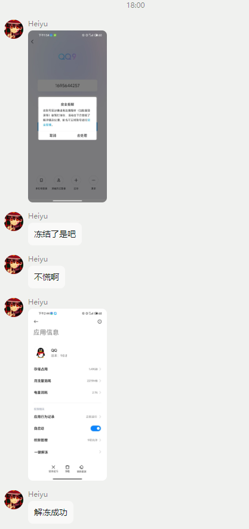

## 专业 Kali 使用大师

2023.7.24

2443045255

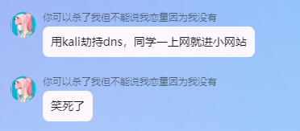

## 多玩我的世界盒子员工

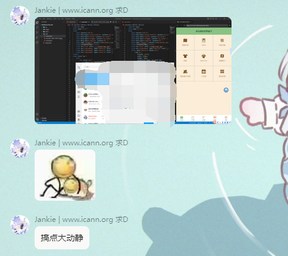

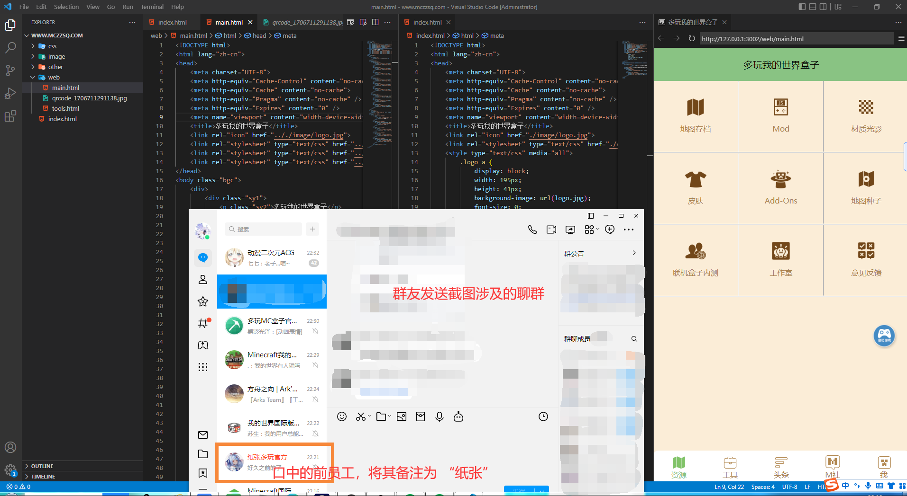

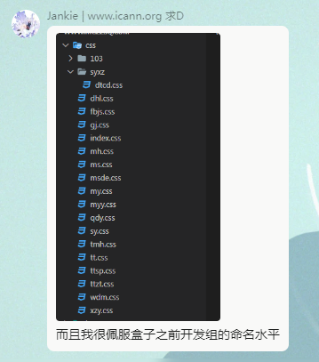

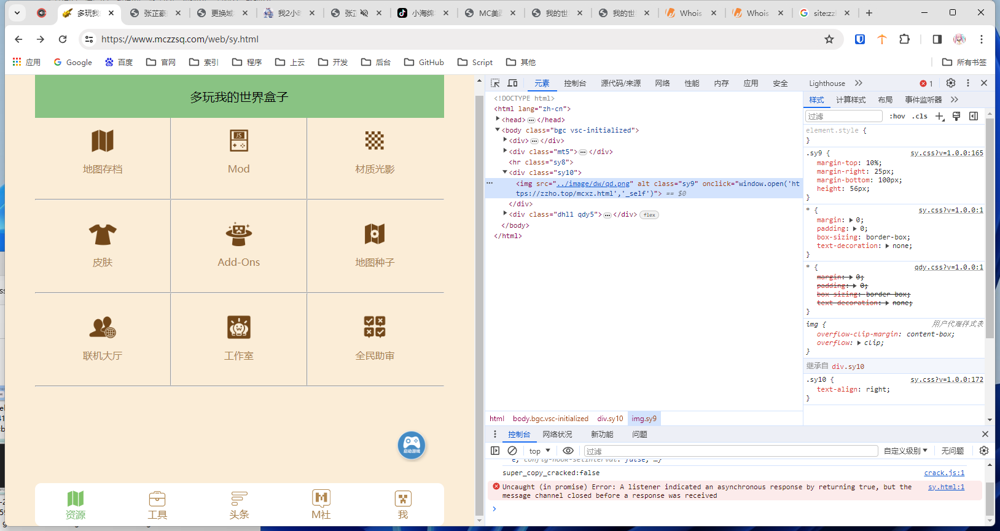

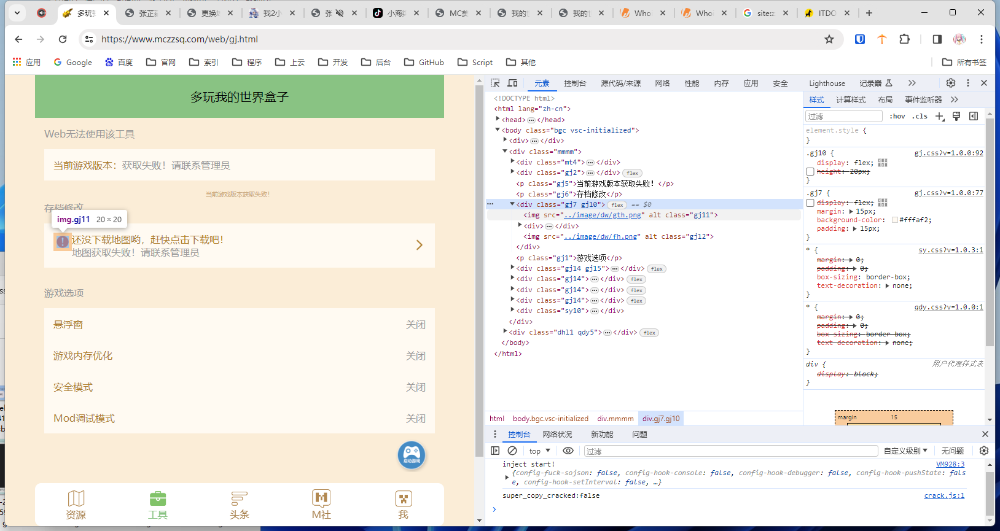

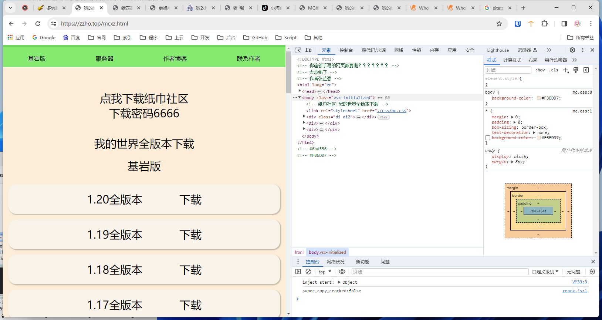

## 高级硬盘出售商家

《 下 单 必 读 》

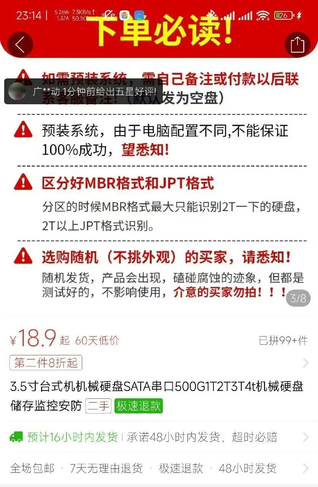

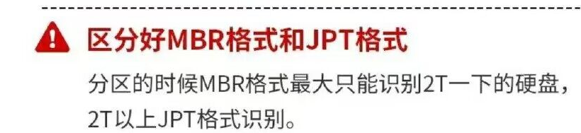

## 安卓直装文件

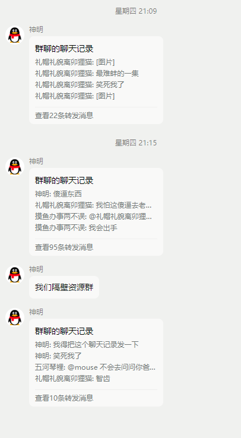

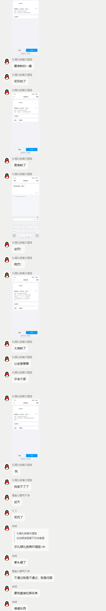

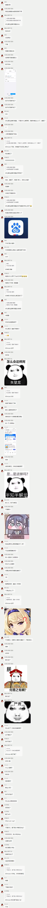

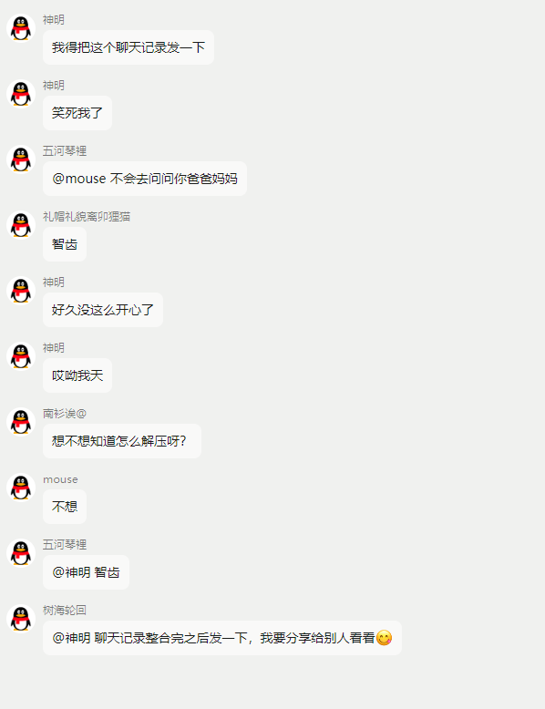

---

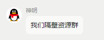

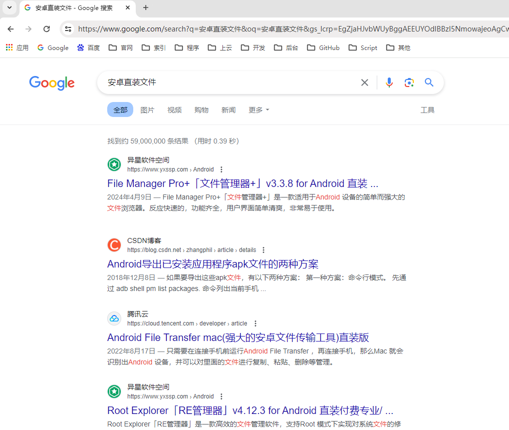

**Android 包**（英语：Android Package，**APK**），是[Android](https://zh.wikipedia.org/wiki/Android)[操作系统](https://zh.wikipedia.org/wiki/操作系统)使用的一种[应用程序](https://zh.wikipedia.org/wiki/应用程序)包文件格式，用于分发和安装[移动应用](https://zh.wikipedia.org/wiki/移动应用)及[中间件](https://zh.wikipedia.org/wiki/中间件)。一个 Android 应用程序的代码想要在 Android 设备上运行，必须先进行[编译](https://zh.wikipedia.org/wiki/编译)，然后被打包成为一个被 Android 系统所能识别的文件才可以被运行，而这种能被 Android 系统识别并运行的[文件格式](https://zh.wikipedia.org/wiki/檔案格式)便是“APK”。 一个 APK 文件内包含被编译的代码文件(.dex 文件)，文件资源（resources）， assets，证书（certificates），和清单文件（manifest file）。[维基百科](https://zh.wikipedia.org/zh-cn/APK)

那么问题来了，聊天记录中的 “**安卓直装文件**” 是什么
